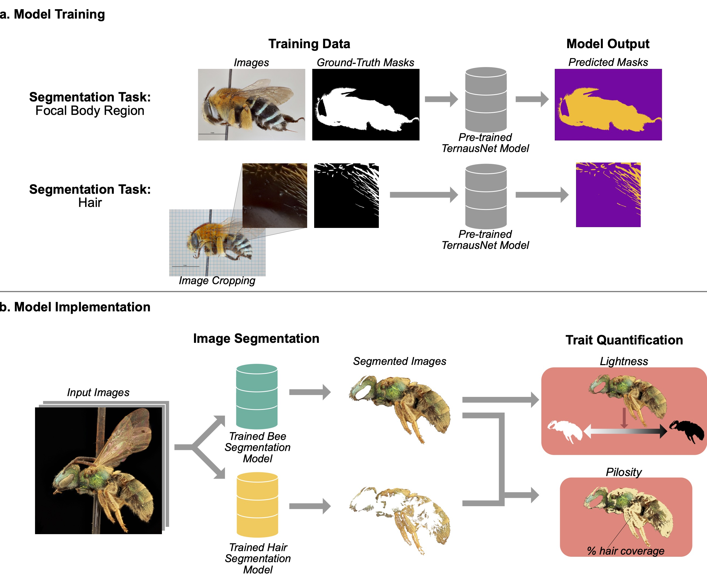

# A computer vision model for automated analysis of bee lightness and pilosity
[](https://doi.org/10.5281/zenodo.12572899)

Here, we present a computer vision model that uses image segmentation to analyze bee trait data. This model takes lateral images of bee specimens and segments a focal region of the body which excludes the wings, eyes, antennae, tongue, and stinger. This focal body region is the principal hair-covered region of the bee's body. This segmentation model also removes the bee from it's background and specimen pin, if present. A second segmentation model takes the output image and further segments the hair from the non-hair regions of the bee. Using these two segments, we calculate the proportion of the focal body region covered in hair. We also use the segmented focal body region to estimate the overall coloration of the bee's body surface, quantified as the median pixel lightness value of all bee pixels. 

More information on the project can be found in the related publication, Computer vision reveals climate predictors of global functional trait variation in bees: [](https://doi.org/10.5281/zenodo.12572899)



## Repository Contents

### Image Segmentation

To run all segmentation and analysis code:
```
$python main.py
```
**segment_bee.py**: Used to segment the focal body region (bee body segmented from background, specimen pin, eyes, wings, antennae, stinger, tongue). This same script can be used for additional model training on labeled datasets (images and corresponding masks), if desired.

**segment_hair.py**: Used to segment hair from non-hair. Uses artificial bees as input (see below). This same script can be used for additional model training, if desired.

**artificial_bees.py**: Used to create images of the resulting segments from the segmentation tasks above. These segments are known as "artifical bees" and "artificial hair,"

**make_folders.py**: Creates the necessary directories if they do not already exist.

**classes.py**: Contains the Python classes used by the other scripts.

**functions.py**: Contains most of the functions used by the other scripts.

**paths.py**: Contains file paths used by the other scripts.

## Trait Quantification
Scripts to quantify bee pilosity and lightness from the image segments created above.

**calculate_surface_area.py**: Calculates hair coverage for each image by dividing the number of predicted hair pixels by the number of predicted bee pixels.

**calculate_brightness.py**: Calculates lightness as the median pixel-wise lightness in the focal body region segment. 

## Model Training
Additional scripts useful for further model training.

**bee_crops.py**: Divides images into smaller cropped images. This is useful when creating hair masks, because manually masking hair from whole images is very labor intensive. 

**make_augment_functions.py**: Contains the functions used to create augmented images and masks. Can be used to expand training datasets.

**make_augmentations.py**: Creates augmented images and masks.


## Miscellaneous Scripts and Files
Additional resources under development, not featured in the main publication.

**remove_background.py**: Removes the backgrounds from bee images and saves those images into a separate folder. 

**entropy_analysis.py**: Calculates the pixel-wise entropy of each image. In the context of information theory, entropy is the expected amount of information or uncertainty present in a variable. [The use of entropy values to analyze bee hair](https://pubmed.ncbi.nlm.nih.gov/28028464/) was done by Stavert et. in 2016.

**hairiness_score.py**: Generates a pilosity score a scale of 0 to 5, with 5 being the hairiest and 0 being the last hairy. This classification is done using a [ResNet50](https://arxiv.org/abs/1512.03385) model.

**image_regression.py** Contains three functions for scoring pilosity. The first function, named image_regression(), trains a ResNet model to classify images of bees with a level of hairiness from 0 to 5. It is very important to note that you should not run this function unless you have a csv file that contains ground truth hairiness ratings of the bee images you are attempting to give hairiness scores to.


### Description of Directories
You can either run make_folders.py or manually create the necessary folders based on your needs. If you wish to change any of the filenames, the filenames of each folder can either be manually changed or changed in paths.py before the folders are created.

**root:** The path of the directory where everything is located. Called by getting os.cwd(). For organization purposes, every subfolder and script should be located in the root folder. All other folders will be named assuming they are located in the root folder.

**bee_images_directory**: This is the file path for the original full bee images. Use this folder to store the images of bees you wish to analyze.

path: root + 'bee_original/'

**original_bee_masks_directory**

path: root + 'original_bee_masks/'

If you have manually created bee masks you would like to use for additional training, upload them to this folder. This folder is not for storing predicted bee masks created by machine learning models.

**bee_masks_directory**

path = root + 'predicted_bee_masks/'

This is the file path for the predicted bee masks, which are segmented by the machine learning model. If you run a script to segment out the eyes, wings, and antennae from bee images, the resulting masks will automatically be saved here, unless you set save = False in resize_predictions.

**artificial_bees_directory**

path: root + 'artificial_bees/'

This is the file path for the artificial bees, which are created by multiplying the predicted bee masks with the original bee images.
These are images created to artificially remove the eyes, wings, and antennae. Used for hair segmentation.

**hair_images_directory**

path: root + 'hair_original/'

This is the file path for the original full bee images. Use this folder to store the images of bees you wish to analyze.

**original_hair_masks_directory**

path: root + 'original_hair_masks/'

If you have manually created hair masks you would like to use, upload them to this folder. This folder is not for storing predicted hair masks created by machine learning models.

**hair_masks_directory**

path = root + 'predicted_hair_masks/'

This is the file path for the predicted hair masks, which are segmented by another machine learning model. If you run a script to segment out the hair from bee or artificial bee images, the resulting masks will automatically be saved here, unless you set save = False in restitch_predictions.

**artificial_hair_directory**

path - root + 'segmented_hair_final/'

This is the file path for the folder that will contain the final "artificial hair", which are created by multiplying the artificial bee images with the predicted hair masks. The resulting images are the result of two machine learning models working to artificially remove anything that is not hair from the original bee images, so the resulted hair can be used for a variety of image analysis.

**background_bees_directory**

path = root + 'removed_background_bees/'

If you choose to artificially remove the backgrounds of your bee images by running remove_background.py, which may help produce more accurate bee segmentations, the removed background images should automatically appear in this folder after running the script.

**aug_im_dir**

path = root + 'augmented_images/'

This is the folder that will contain all folders of augmented images. If you intend to use any augmentations during model training, run make_augmentations.py and the resulting augmented images will appear in subdirectories in this folder. If you want to use augmentations for both bee and hair model training, make another copy of this folder.

**aug_mask_dir**

path = root + 'augmented_mask/'

This is the folder that will contain all folders of augmented masks. If you intend to use any augmentations during model training, run make_augmentations.py and the resulting masks for the corresponding augmented images will appear in subdirectories in this folder. If you want to use augmentations for both bee and hair model training, make another copy of this folder.

**crop_path**

path = root + 'bee_crops/'

This is a folder that will contain rectangular crops of artificial bees, which will range in size anywhere from 256 x 256 to 556 x 556. You likely will not need to use this folder unless you are using crops to make more hair masks.

**entropy_output_path**

path = root + 'entropy_images/'

This folder contains the outputs of entropy analysis on images. Only use if you intend to do entropy analysis on bees or bee hair. There is currently no pair of subfolders for entropy analysis on bees and bee hair, so if you wish to do entropy analysis on both, create another similarly named folder and change the folder names in the entropy analysis code in main.py.

**entropy_values**

path = root + 'entropy_analysis/'

This folder contains the results of the entropy analysis, such as entropy values for a dataset.

**image_regression**

path = root + 'image_regression/'

This folder contains the data and models necessary for the hairiness rating scripts. Use if you plan on calculating hairiness scores for bee images.

### Citation
